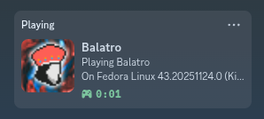

# discord-rpc-bridge

A bridge to update Discord Rich Presence status with your current Steam game on Linux.

This works with both native and Flatpak Steam, and supports native, Flatpak, and Snap Discord.
It scans `/proc` on an interval to detect running Steam games (native and Proton) and sets your Discord activity status via IPC.



## Limitations

- Linux only, systemd only
- Supports both native and Proton games. Game detection works by matching `steamapps/common` in process paths.
- Only detects Steam games. Could potentially scan for other processes (KiCad, VSCode, Neovim, etc.)
- Only tracks one game at a time (first match in `/proc`).
- Activity status shows your distro name instead of game-specific rich presence assets.

## Installation

Download the latest release and install as a systemd service:

```sh
curl -fsSL https://raw.githubusercontent.com/barrettotte/discord-rpc-bridge/master/scripts/download.sh | bash
```

### Build from source

```sh
git clone https://github.com/barrettotte/discord-rpc-bridge && cd discord-rpc-bridge
make build
make install
```

### Updating

Re-run the install script. This will stop the service, update the binary, and overwrite the config with defaults.

```sh
systemctl --user stop discord-rpc-bridge
curl -fsSL https://raw.githubusercontent.com/barrettotte/discord-rpc-bridge/master/scripts/download.sh | bash
```

### Verify / Logs / Uninstall

```sh
# verify
systemctl --user status discord-rpc-bridge

# view logs
journalctl --user -u discord-rpc-bridge -f

# uninstall
make uninstall
```

## Configuration

```js
{
  // how often to rescan /proc
  "scan_interval_seconds": 15,

  // Discord API version to use in game list download
  // ex: https://discord.com/api/v10/applications/detectable
  "discord_api_version": 10,

  // how often to invalidate the Discord game list cache
  "game_cache_ttl_days": 7,

  // steamapps/common folder names to ignore during game detection
  "ignored_games": [
    "SteamLinuxRuntime_soldier",
    "SteamLinuxRuntime_sniper",
    "SteamLinuxRuntime",
    "SteamControllerConfigs",
    "Proton - Experimental",
    "Proton Experimental",
    "Proton 7.0",
    "Proton 8.0",
    "Proton 9.0",
    "Proton Hotfix",
    "shader_compiler"
  ],

  // process exe basenames to skip entirely during /proc scanning.
  // prevents Steam launcher/wrapper processes from false-detecting games
  // via their command line arguments.
  "ignored_processes": [
    "gamescopereaper",
    "reaper",
    "steam-launch-wrapper",
    "pressure-vessel-wrap"
  ]
}
```

## Discord Detectable Applications JSON

```sh
curl https://discord.com/api/v10/applications/detectable -o data/games.json

jq 'length' data/games.json
# 19551

jq '.[] | select(.name == "Balatro")' data/games.json
# {
#   "id": "1209665818464358430",
#   "name": "Balatro",
#   "executables": [
#     {
#       "name": "balatro/balatro.exe",
#       "os": "win32"
#     }
#   ]
# }
```
